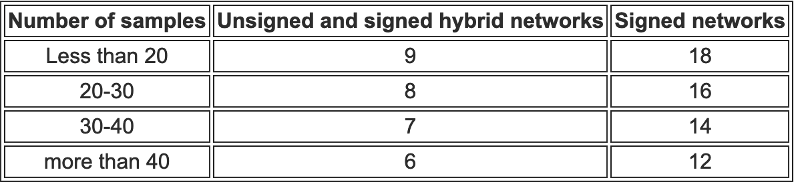

```{r setup, echo=FALSE, results="hide"}
knitr::opts_chunk$set(tidy = FALSE,
                      cache = FALSE,
                      dev = "png",
                      message = FALSE, error = FALSE, warning = TRUE)
temp_output_dir <- tempdir()
current_dir <- getwd()
library(RNAseqEasy)
```

# Aim

The aim of this package is to simplify RNAseq analysis by integrating some pre-existing widely used packages (DESeq2 [@DESeq2], topGO [@topGO], WGCNA [@WGCNA] and rrvgo [@sayols2023], in a tidyverse [@wickham2019] environment) to obtain results and visualization after performing differential expression analysis, PCA, Gene Ontology enrichment and gene co-expression clustering.

```{r Diagram, echo = FALSE}
library(DiagrammeR)

grViz("
digraph RNAseqEasy {
  graph [layout = dot, rankdir = TB]

  node [shape = box, style = filled, fillcolor = lightblue, fontname = Helvetica]

  A [label = 'Input\n(Salmon + sample table)']
  B [label = 'Functional annotation\n(tx2gene + GO terms)']
  C [label = 'DEGs\n(DESeq2)']
  D [label = 'Enriched GO terms\n(topGO)']
  E [label = 'PCA']
  F [label = 'Co-expression clusters\n(WGCNA)']
  G [label = 'Visualization & results', shape = ellipse, fillcolor = '#67feee']

  A -> C
  B -> C
  A -> E
  C -> E
  C -> D
  C -> F
  F -> D
  C -> G
  D -> G
  E -> G
  F -> G
}
")
```

The data used as example in this vignette was generated in the work of Liang et al. [@liang2024] in the liverwort *Marchantia polymorpha*.

# Standard workflow

## Quick start

The main function in `RNAseqEasy` package is `DESeq2_simple()`, which performs principal component analysis, differential expression analysis and Gene Ontology enrichment analysis from quantified samples.

```{r QuickStart, eval=FALSE}
DiffExprAn <- DESeq2_simple(
  output_path = output_Dir_DESeq2, # Path to save results
  sampleDir = sampleDir, # Directory with your Salmon quantified data
  sample_table = sample_table, # Data frame with your sample names and variables
  tx2gene = Marchantia7_tx2gene, # Data frame with your Gene - Transcript relationship
  Variable = c("Variable1", "Variable2"), # Variables from sample_table affecting your analysis
  Design = "Variable1 + Variable2 + Variable1:Variable2", # How to model samples
  Name = "Name_comparison", # Name to include in result files
  Contrast = list(c("ContrastA", "ContrastB")) or ContrastA - ContrastB, 
  geneID2GO = geneID2GO, # GO functional annotation
  orgdb = "org.At.tair.db" # Reference organism from rrvgo database
  )
```

```{r DESeq2_simple Diagram2, fig.cap="DESeq2_simple() function general scheme", out.height= "70%", echo = FALSE}
grViz("
digraph RNAseqEasy {
  graph [layout = dot, rankdir = TB]

  node [shape = box, style = filled, fillcolor = lightblue, fontname = Helvetica]

  A [label = 'quant files \n(Salmon)']
  B [label = 'Sample data']
  C [label = 'Transcripts-Genes data frame \n(tx2gene)']
  D [label = 'GO annotation']
  E [label = 'DESeq2_simple() function', fillcolor = '#aeffac']
  F [label = 'PCA']
  G [label = 'Differential expression analysis \n(DEGseq2)']
  H [label = 'Gene Ontology Enrichment \n(topGO)']

  A -> E
  B -> E
  C -> E
  D -> E
  E -> F
  E -> G
  E -> H
}
")
```

## Input data

The RNAseqEasy package is thought to be used from Salmon mapped and quantified data. The first required input is the path [1] of the directory where `quant.sf` samples are saved. The other input necessary for the analysis is a data frame [2] that includes the name of the samples and the information describing them (i.e. variables or conditions defining the experiment).

### Salmon data

Salmon [@patro2017] is a widely used software for quantifying transcript abundance. A well detailed tutorial can be found in their [official webpage](https://combine-lab.github.io/salmon/getting_started/). It is a very fast tool for transcript quantification directly from `fastq.gz`files. The only requirement is the creation of an index of the **transcriptome** of the organism we are working with (do not use the genome!!!), also explained in their tutorial.

As a result, we will obtain a folder [1] containing one folder per analyzed sample with its names. In each folder, the main output fail will be named `quant.sf`, which contains the name of each transcript and their abundance in Transcripts Per Million (TPM), among other information (length, effective length and number of reads). The path to this output folder will be input for our analysis [1].

In this example, we will download the `quant.sf` files from Liang et al. [@liang2024] experiment.

```{r zenodo}
# URL from Zenodo
data_url <- "https://zenodo.org/records/15800134/files/GSE275561.zip?download=1"

# Temporal directory to download data
output_dir <- file.path(tempdir(), "GSE275561")
dir.create(output_dir, recursive = TRUE, showWarnings = FALSE)

zip_file <- file.path(tempdir(), "GSE275561.zip")

# Download zip file with Salmon quantified data from Zenodo
download.file(url = data_url, destfile = zip_file, mode = "wb")

# Unzip compressed file
unzip(zip_file, exdir = output_dir)

list.files(output_dir)
```

So, we set the "02_Salmon" folder as `sampleDir`, which will direct the analysis to the directory to retrieve quantified data for each sample.

```{r sampleDir}
sampleDir <- file.path(output_dir, "02_Salmon")
```

### Sample table

For each experiment analysis, it is required to generate a data frame [2] (we call it `sample_table`) which correlates the name of each sequenced sample with the variables describing it in the experiment. You can create it in R or import it from a file. It has to include a `Sample` column including sample names, and an extra column for each variable of factor that were included in the experiment design. In our example, we include 12 different samples (Wendy1 to Wendy12), and there were 3 different variables describing them:

-   `Genotype`. Samples were divided in two different genotypes: 'Tak1' (wild-type organisms) and '*gh3a*' (CRISPR-Cas9 mutants).
-   `Treatment`. Two different treatments were applied to samples: 'Mock' or 'OPDA' (exposure to a high concentration of a plant stress hormone from jasmonic acid family).
-   `Replicate`. Each category of samples included 3 independent biological replicates.

```{r sample_data}
# Data frame with 'Sample', 'Genotype', 'Treatment and 'Replicate' information

sample_table <- data.frame(
  Sample = paste0("Wendy", seq(1,12)),
  Genotype = rep(c("Tak1", "gh3a"), each = 6),
  Treatment = rep(c("Mock", "OPDA"), each = 3),
  Replicate = seq(1,3)
)

sample_table
```

In differential expression analysis, comparisons are performed against a reference level. By default, R set levels based on alphabetical order for each variable. We can set the specific comparison we want to perform in each analysis, but it is a good practice to set levels order as we want to before we continue. We transform each variable column into factor and establish the level order. In this example, "Tak-1" is the reference genotype, and "Mock" is the reference treatment.

```{r factors}
# Convert 'Genotype' into factor, setting "Tak1" as reference
sample_table$Genotype <- factor(sample_table$Genotype,
                                levels = c("Tak1", "gh3a"))

# Convert 'Treatment' into factor, setting "Mock" as reference
sample_table$Treatment <- factor(sample_table$Treatment, levels = c("Mock", "OPDA"))

str(sample_table)
```

### Functional annotation

Everything else required for the analysis is not specific of the experiment you are performing, but depends on the organism you are working with. There are two different files that we will need to import for the analysis:

-   A data frame that correlates each transcript name with its corresponding gene name.
-   A file including functional annotation, i.e., correlating each gene/transcript to GO terms.

In this example, we are working with samples extracted from the liverwort *Marchantia polymorpha*, a model plant widely use to study how ancient or conserved biological processes are in plant evolution. To get the reference transcriptome, we download it from [marchantia.info](https://marchantia.info/), the Genome Database for *Marchantia polymorpha*. The `get.fasta.name()` function from phylotools [@revell2024] package allows us to obtain the transcript names from the fasta file. In *Marchantia*, gene names and transcript share the same nomenclature, only adding a dot and a number to the different transcripts of a gene. To correlate them, we create a data frame including a column called `Name` containing transcript names, and based on that we create a new column called `GENEID` removing last 2 characters (using `str_sub()` function from string package).

```{r mRNA_fasta, warning=FALSE}
library(phylotools)
library(tidyverse)
URL <- gzcon(url(paste("https://marchantia.info/download/MpTak_v6.1/", "MpTak_v6.1r1.mrna.fasta.gz", sep="")))
txt <- readLines(URL)
Marchantia7_Transcripts <- get.fasta.name(textConnection(txt), clean_name = FALSE)
head(Marchantia7_Transcripts)

Marchantia7_tx2gene <- data.frame(Name = Marchantia7_Transcripts) %>%
  tidyr::separate(Name, sep = " ", into = c("TXNAME", "CDS")) %>%
  dplyr::mutate(GENEID = stringr::str_sub(TXNAME, 1, -3)) %>%
  dplyr::select(-CDS)

head(Marchantia7_tx2gene, 10)
```

For this example, functional annotation of Gene Ontologies (GOs) for *Marchantia* genes can be downloaded from the package in a csv file. Many organisms reference databases include this kind of files. If you cannot find them, try to find tools and tutorials to annotate your reference genome.

```{r FunctionalDB}
library(RNAseqEasy)

GO_data <- system.file("extdata",
                      "Mpo6.1_GO_db_GeneGO.csv",
                      package="RNAseqEasy", mustWork=TRUE)
Mpo_GO_GOSLIM <- read.csv(GO_data, sep = "\t")
head(Mpo_GO_GOSLIM)
```

This annotation file is a two column data frame correlating transcript names and GO terms (one assotiation per row). For topGO GO enrichement analyses, we will need to convert it into a list containing transcript as keys and all their annotated GO terms as values. The `load_topGO_db()` function included in this package helps us in this purpose.

```{r loadGO}
geneID2GO <- load_topGO_db(Mpo_GO_GOSLIM, "Transcript", "GO")
head(geneID2GO)
```

To perform GO semantic clustering, the analysis is based on rrvgo [@sayols2023] and GOSemSim [@yu2020] packages. The available species for this analysis are included in [Bioconductor webpage](https://bioconductor.org/packages/release/BiocViews.html#___OrgDb). The only plant organism included is *Arabidopsis thaliana*, so we will use its code (org.At.tair.db) for this analysis. We can save this data in an object, so it will save computing time in the following analysis. There are three classes of GO terms: Biological Processes (BP), Molecular Functions (MF) and Cell Components (CC). In this example, we will only be focused on biological processes.

```{r At_tair, warning=FALSE}
save <- GOSemSim::godata("org.At.tair.db", ont="BP")
```

## Differential gene expression analysis

At this point, we already have everything we need to perform our RNA-seq analysis: a directory with our quantified samples (`sampleDir`), a data frame with the experiment metadata (`sample_table`), a data frame correlating gene names and transcript names for our organism (`Marchantia7_tx2gene`), an annotation list correlating transcript names and their annotated GO terms (`geneID2GO`) and the model organism reference data for the semantic clustering (`save`).

We want to obtain differential expressed genes (DEGs) in **Tak-1 genotype in OPDA treatment compared to Tak-1 genotype in Mock conditions**. To organize our results, we will create a folder to save all differential expression analyses and we will call it "DESeq2", and inside we will create another folder to save specifically this comparison, and we will call it "Tak1_OPDA".

```{r ouputDirDESeq2}
dir.create(file.path(output_dir, "DESeq2"))
dir.create(file.path(output_dir, "DESeq2", "Tak1_OPDA"))
output_Dir_DESeq2 <- file.path(output_dir, "DESeq2", "Tak1_OPDA")
```

To run the analysis, we should install [DESeq2](https://bioconductor.org/packages/release/bioc/html/DESeq2.html) and [topGO](https://bioconductor.org/packages/release/bioc/html/topGO.html) packages from Bioconductor and load them in our R session.

Now, we are ready to run our differential expression analysis. For that, we will use `DESeq2_simple` function. We set all required parameters that we previously defined (`output_path`, `sampleDir`, `sample_table`, `tx2gene`, `geneID2GO`, `orgdb` and `semdata`). But, still, there are some parameters that we have to define for this analysis:

-   **Name**: We have to include a string to name all files that are going to be generated. In this example, we use the same as the folder where they will be saved ("Tak1_OPDA").
-   **Variable**: Vector of variables or factors that are affecting gene expression in the experiment.
-   **Design**: Design formula indicating the variables which will be used in the modelling, i.e., which variables we expect that are having an effect in gene expression in the analysis. In this example, we expect that "Genotype" itself (there will be genes which expression will be expected to be affected only by genotype in any condition), "Treatment" itself (there will be genes which expression will be expected to be affected only by treatment in any genotype), and the interaction "Genotype+Treatment" (there will be genes which expression will be expected to be affected differently by treatment in a genotype compared to the other), will be affecting gene expression. Therefore, our design formula will be "Genotype + Treatment + Genotype:Treatment". (For more information about design, read the [DESeq2 vignette](https://bioconductor.org/packages/devel/bioc/vignettes/DESeq2/inst/doc/DESeq2.html)).
-   **Contrast**: The specific contrast we want to perform to test differential expression. If we do not specify any contrast, the function will stop and there will be printed all possible contrast we can use in the experimental design we are using. There are two different ways to define the contrast we want to:
    -   Condition A - Condition B.
    -   list(c("Contrast")).

For more information about contrasts, read the [DESeq2 vignette](https://bioconductor.org/packages/devel/bioc/vignettes/DESeq2/inst/doc/DESeq2.html) and check this [tutorial](https://github.com/tavareshugo/tutorial_DESeq2_contrasts).

```{r SelectContrast, error = TRUE, warning=FALSE}
library(DESeq2)
library(topGO)

DESeq2_simple(
    output_path = output_Dir_DESeq2,
    sampleDir = sampleDir,
    sample_table = sample_table,
    tx2gene = Marchantia7_tx2gene,
    geneID2GO = geneID2GO,
    orgdb = "org.At.tair.db",
    semdata = save,
    Name = "Tak1_OPDA",
    Variable = c("Genotype", "Treatment"),
    Design = "Genotype + Treatment + Genotype:Treatment"
  )
```

After running `DESeq2_simple` with no `Contrast` parameter, there is an error telling us we have to choose one of the previous contrasts printed in the console. In this example, we want to compare Tak-1 genotype in OPDA treatment samples vs. Tak-1 genotype in Mock conditions. There are two different ways we can set this contrast:

-   Tak1_OPDA - Tak1_Mock.
-   list(c("Treatment_OPDA_vs_Mock")). Since we established Tak-1 as our reference genotype (first factor), the treatment OPDA vs Mock contrast will get this comparison in the reference genotype, i.e., Tak-1.

```{r DESeq2_simple, warning=FALSE}
Tak1_OPDA_result <- DESeq2_simple(
    output_path = output_Dir_DESeq2,
    sampleDir = sampleDir,
    sample_table = sample_table,
    Include = NULL,
    Exclude = NULL,
    tx2gene = Marchantia7_tx2gene,
    Variable = c("Genotype", "Treatment"),
    Design = "Genotype + Treatment + Genotype:Treatment",
    Group = "NO",
    Name = "Tak1_OPDA",
    Contrast = Tak1_OPDA - Tak1_Mock,
    Reduced = FALSE,
    log2FCtopGO = 1,
    geneID2GO = geneID2GO,
    ontology = "BP",
    plot_similarity = TRUE,
    orgdb = "org.At.tair.db",
    semdata = save
  )
```

If we want to perform other possible analyses, these would be the contrast we would have to use:

-   **OPDA vs Mock in *gh3a* genotype**: gh3a_OPDA - gh3a_Mock, or list(c("Treatment_OPDA_vs_Mock", "Genotypegh3a.TreatmentOPDA")).

-   ***gh3a*** **vs Tak-1 in Mock conditions**: gh3a_Mock - Tak1_Mock, or list(c("Genotype_gh3a_vs_Tak1")).

-   ***gh3a*** **vs Tak-1 in OPDA conditions**: gh3a_OPDA - Tak1_OPDA, or list(c("Genotype_gh3a_vs_Tak1", "Genotypegh3a.TreatmentOPDA")).

-   **Genes affected by the Genotype:Treatment interaction**: (gh3a_OPDA - gh3a_Mock) - (Tak1_OPDA - Tak1_Mock), or list(c("Genotypegh3a.TreatmentOPDA")). This are genes that will be responding to OPDA treatment in the *gh3a* genotype in a different way that the expected from the response in Tak-1 genotype.

```{r DESeq2_interaction, warning=FALSE}
dir.create(file.path(output_dir, "DESeq2", "Genotype_Treatment_interaction"))
output_Dir_interaction <- file.path(output_dir, "DESeq2", "Genotype_Treatment_interaction")
Genotype_Treatment_result <- DESeq2_simple(
    output_path = output_Dir_interaction,
    sampleDir = sampleDir,
    sample_table = sample_table,
    Include = NULL,
    Exclude = NULL,
    tx2gene = Marchantia7_tx2gene,
    Variable = c("Genotype", "Treatment"),
    Design = "Genotype + Treatment + Genotype:Treatment",
    Group = "NO",
    Name = "Genotype_Treatment_interaction",
    Contrast = list(c("Genotypegh3a.TreatmentOPDA")),
    Reduced = FALSE,
    log2FCtopGO = 1,
    geneID2GO = geneID2GO,
    ontology = "BP",
    plot_similarity = TRUE,
    orgdb = "org.At.tair.db",
    semdata = save
  )
```

### Sample selection

By default, all samples in `sampleDir` will be included for the differential expression analysis using `DESeq2_simple` function. However, it could be interesting to perform an analysis including only a subset of these samples. For example, let's think about the scenario where we want to study DEGs by OPDA in Tak-1 genotype ignoring the existence of *gh3a* in the experiment. Thus, we would only want to include samples belonging to Tak-1 genotype. There are two possible ways of doing that in `DESeq2_simple` function: by using `Include` or `Exclude` parameters.

-   `Include`: we define features in a vector that all samples must present to be included in the analysis. In this example, it would be `Include = c("Tak1")`.
-   `Exclude`: we define features in a vector that we want to remove from the analysis. All samples containing any of these features will be removed. In this example, it would be `Exclude = c("gh3a")`.

In our example, both parameters would work the same way, i.e., only including Tak-1 samples in the analysis, both in OPDA and Mock treatments.

### PCA

Apart from differential expression analysis, all samples included in the `DESeq2_simple` function will be compute for principal component analysis and we will obtain a png file of PC1 vs PC2 using 500 top genes by default. If we do not want to generate the PCA, we can set the `PCA` parameter to `FALSE` within the `DESeq2_simple` function. If we want to perform a different principal component analysis (plotting other component, using a different number of top genes, changing colors, etc...) we can do it by running the `run_pca_analysis` function.

### Output

After running `DESeq2_simple` function, there are some files generated with results from the differential gene expression analysis:

-   Two tab-delimited text files are generated including results from the differential expression analysis of all genes (Name.txt) and only significantly expressed genes, i.e., $padj \le 0.05$ (Name_Sig.txt).

```{r Sigtable, echo=FALSE}
sigtable <- read.table(file.path(output_Dir_DESeq2, "Tak1_OPDA.txt"), header = TRUE)
head(sigtable)
```

-   A PDF file including a heatmap of $log2(n + 1)$ normalized values of all samples included in the analysis (Name_heatmap.pdf).

```{r heatmap1, include = FALSE}
setwd(file.path(output_Dir_DESeq2))
ruta_pdf_generado <- file.path(output_Dir_DESeq2, "Tak1_OPDA_heatmap.pdf")
rutas_png_generadas <- pdftools::pdf_convert(
  pdf = ruta_pdf_generado,
  format = "png",
  dpi = 150 
)
setwd(current_dir)
```

```{r heatmap2, echo=FALSE, fig.cap="Heatmap of normalized values of DEGs in the OPDA vs Mock comparison for Tak-1 genotype"}
knitr::include_graphics(rutas_png_generadas[1])
```

-   A png file including the PCA of all samples included in the analysis, only if `PCA` parameter is set as the `TRUE` default value (PCA_Name.png).

```{r PCA, echo=FALSE, fig.cap="PCA plot of PC1 vs PC2, using 500 top genes", out.height= "40%"}
ruta_PCA_generado <- file.path(output_Dir_DESeq2, "PCA_Tak1_OPDA.png")
knitr::include_graphics(ruta_PCA_generado)
```

-   A "topGO" folder, including results of GO enrichment analysis for Up, Down and Up+Down DEGs ($padj \le 0.05$, and $log2(FC) \ge 1$ for Up-regulated and $log2(FC) \le -1$ for Down-regulated genes):
    -   Two tab-delimited text files including results from the GO enrichment analysis. One include detailed results (topGO_Name_All/Up/Down_results.txt) and the other only enriched GO terms and their p-values (topGO_Name_All/Up/Down_pvals.txt).

```{r SigGOs, echo=FALSE}
sigGOs <- read.delim(file.path(output_Dir_DESeq2, "topGO","topGO_Tak1_OPDA_Up_results.txt"))
head(sigGOs)
```

-   Three PDF files for GO enrichment visualization:
    -   A tree map plot of semantic-clustered GO terms (topGO_Name_All/Up/Down_Treemap.pdf).

    -   A scatter plot of semantic-clustered GO terms (topGO_Name_All/Up/Down_Scatterplot.pdf).

    -   A bubble plot of all enriched GO terms in descendant order according to their enrichment (topGO_Name_All/Up/Down_bubble.pdf).

```{r tree1, include=FALSE}
setwd(file.path(output_Dir_DESeq2, "topGO"))
path_pdf_tree <- file.path(output_Dir_DESeq2, "topGO", "topGO_Tak1_OPDA_Up_Treemap.pdf")
path_png_tree <- pdftools::pdf_convert(
  pdf = path_pdf_tree,
  format = "png",
  dpi = 150 
)
path_png_tree <- file.path(output_Dir_DESeq2, "topGO", path_png_tree)
setwd(current_dir)
```

```{r tree2, echo=FALSE, fig.cap="Tree map of Gene Ontologies enriched in Up-regulated genes"}
knitr::include_graphics(path_png_tree[1])
```

```{r scatterplot1, include=FALSE}
setwd(file.path(output_Dir_DESeq2, "topGO"))
path_pdf_scatter <- file.path(output_Dir_DESeq2, "topGO", "topGO_Tak1_OPDA_Up_Scatterplot.pdf")
path_png_scatter <- pdftools::pdf_convert(
  pdf = path_pdf_scatter,
  format = "png",
  dpi = 150 
)
path_png_scatter <- file.path(output_Dir_DESeq2, "topGO", path_png_scatter)
setwd(current_dir)
```

```{r scatterplot2, echo=FALSE, fig.cap="Semantic cluster of Gene Ontologies enriched in Up-regulated genes"}
knitr::include_graphics(path_png_scatter[1])
```

```{r bubble1, include=FALSE}
setwd(file.path(output_Dir_DESeq2, "topGO"))
path_pdf_bubble <- file.path(output_Dir_DESeq2, "topGO", "topGO_Tak1_OPDA_Up_bubble.pdf")
path_png_bubble <- pdftools::pdf_convert(
  pdf = path_pdf_bubble,
  format = "png",
  dpi = 150 
)
path_png_bubble <- file.path(output_Dir_DESeq2, "topGO", path_png_bubble)
setwd(current_dir)
```

```{r bubble2, echo=FALSE, fig.cap="Bubble plot of Gene Ontologies enriched in Up-regulated genes"}
knitr::include_graphics(path_png_bubble[1])
```

## Clustering of co-expressed genes

```{r WGCNA_Module Diagram2, fig.cap="WGCNA_Module() function general scheme", out.height= "70%", echo = FALSE}

grViz("
digraph RNAseqEasy {
  graph [layout = dot, rankdir = TB]

  node [shape = box, style = filled, fillcolor = lightblue, fontname = Helvetica]

  A [label = 'Transcript IDs vector']
  B [label = 'quant files \n(Salmon)']
  C [label = 'Sample data']
  D [label = 'Transcripts-Genes data frame \n(tx2gene)']
  E [label = 'GO annotation']
  F [label = 'WGCNA_Module() function', fillcolor = '#ffffe0']
  G [label = 'Co-expression cluster analysis \n(WGCNA)']
  H [label = 'Gene Ontology Enrichment \n(topGO)']

  A -> F
  B -> F
  C -> F
  D -> F
  E -> F
  F -> G
  F -> H
}
")
```

Another application of the package is the generation of co-expressed gene modules by the implementation of components from the WGCNA [@WGCNA] package. This functionality is included in the `WGCNA_Modules` function. As `DESeq2_simple` function, it requires to specify the `output_path`, `sampleDir`, `sample_table`, `Variables`, `tx2gene`, `Name`, `geneID2GO` and `Annotation` parameters. The specific parameters that have also to be included in this function are:

-   `DEGs`: A vector of Gene IDs. This will be the input set of genes that we want to cluster. The Gene IDs must correspond to the transcriptome that we are using in the analysis.
-   `Power`: Soft thresholding power used in the network construction (check the [WGNA manual](https://cran.r-project.org/web/packages/WGCNA/WGCNA.pdf) or [tutorial](https://fuzzyatelin.github.io/bioanth-stats/module-F21-Group1/module-F21-Group1.html) for more info). If we run the `WGCNA_Modules` function without the `Power` parameter specified, it will stops and generate a "softthresholdingpower.pdf" file, that can help us to select the power. As an alternative, this table suggests the power to select depending on the number of samples and type of network: 

Most of the advanced parameters in for the `blockwiseModules` function of the WGCNA package for the module generation are set to default.

As an example, we will use the output DEGs from the Genotype:Treatment interaction in `DESeq2_simple`, i.e., genes that significantly respond to the OPDA treatment in the *gh3a* genotype in a different way than the Tak-1 genotype. This different response can be in different ways, so we will use the gene co-expression modules to explore these responses.

```{r DEGs_interaction}
DESeq2_simple_output <- read.table(file.path(output_Dir_interaction, "Genotype_Treatment_interaction.txt"), 
                                   header = TRUE)

## We get rownames (GeneIDs) of the output data frame from DESeq2_simple(),
## applying a filter of log2FC > 1 for Up-regulated DEGs and log2FC < -1 for
## Down-regulation.

DEGs <- rownames(DESeq2_simple_output %>% filter(log2FoldChange > 1 | log2FoldChange < -1))
```

Now that we already have selected our input gene set, we can run the `WGCNA_Modules` function:

```{r WGCNA_Modules_First, error = TRUE, warning=FALSE}
library(WGCNA)
dir.create(file.path(output_dir, "WGCNA"))
output_WGCNA <- file.path(output_dir, "WGCNA")
COIOPDA_int_Tak1OPDA_WGCNA <- WGCNA_Modules(output_path =output_WGCNA,
                                   sampleDir = sampleDir,
                                   sample_table = sample_table,
                                   DEGs = DEGs,
                                   Variables = c("Genotype", "Treatment"),
                                   tx2gene = Marchantia7_tx2gene,
                                   Name = "Genotype_Treatment_Interaction",
                                   NumberCol = 1,
                                   geneID2GO = geneID2GO,
                                   semdata = save)
```

We did not include the `Power` parameter, so the function stopped at warned us to select it based on the "softthresholdingpower.pdf" file.

```{r soft1, include=FALSE, warning=FALSE}
setwd(output_WGCNA)
path_pdf_soft <- file.path(output_WGCNA, "softthresholdingpower.pdf")
path_png_soft <- pdftools::pdf_convert(
  pdf = path_pdf_soft,
  format = "png",
  dpi = 150 
)
path_png_soft <- file.path(output_WGCNA, path_png_soft)
setwd(current_dir)
```

```{r soft2, echo=FALSE, fig.cap="R^2 values as a function of the soft thresholds"}
knitr::include_graphics(path_png_soft[1])
```

Based on this plot, we will select 7 as the soft thresholding power since it is the first value that rises the threshold.

```{r WGCNA_Modules_Second, warning=FALSE}
COIOPDA_int_Tak1OPDA_WGCNA <- WGCNA_Modules(output_path =output_WGCNA,
                                   sampleDir = sampleDir,
                                   sample_table = sample_table,
                                   DEGs = DEGs,
                                   Variables = c("Genotype", "Treatment"),
                                   tx2gene = Marchantia7_tx2gene,
                                   Name = "Genotype_Treatment_Interaction",
                                   Power = 7,
                                   NumberCol = 1,
                                   geneID2GO = geneID2GO,
                                   semdata = save)
```

There are 6 different clusters or modules that have been generated after the analysis. The average behavior of genes from each category are summarized in the "Summary_Modules_Name.pdf" file:

```{r Summary_Modules1, include=FALSE}
setwd(output_WGCNA)
path_pdf_modules <- file.path(output_WGCNA, "Summary_Modules_Genotype_Treatment_Interaction.pdf")
path_png_modules <- pdftools::pdf_convert(
  pdf = path_pdf_modules,
  format = "png",
  dpi = 150 
)
path_png_modules <- file.path(output_WGCNA, path_png_modules)
setwd(current_dir)
```

```{r Summary_Modules2, echo=FALSE, fig.cap="Summary of gene expression behavior in each co-expression module of genes responding to the Genotype:Treatment interaction"}
knitr::include_graphics(path_png_modules[1])
```

### Output

-   A tab-delimited TXT file for each module, containing genes included in that module and its TPM expression in each sample of the analysis (Module_genes.txt).

-   A CSV file of two columns, including all genes used as input (`DEGs` parameter) and the module name where they were included (Name_geneInfo.csv).

-   Three PDF files:

    -   Module-trait relationships heatmap of each module and each variable (moduleTraitRelationships.pdf).
    -   A sample dendrogram to see how samples cluster in the analysis (sampleClustering.pdf).
    -   A soft thresholding powers plot to help us to select the `Power` parameter (softthresholdingpower.pdf)
    -   The summary plot showing the average behavior of genes included in each module (Summary_Modules_Name.pdf). We can modify the number of columns to organize modules in this figure by changing the `NumberCol` parameter, and the colors of the lines specifying a named vector in the `Colors_plot` parameter (colors as values, variables as names).

-   A "topGO" folder, including same output files for each module as `DESeq2_simple()` function.

## Gene Ontology Enrichment

```{r topGO_All Diagram2, fig.cap="topGO_All() function general scheme", out.height= "70%", echo = FALSE}

grViz("
digraph RNAseqEasy {
  graph [layout = dot, rankdir = TB]

  node [shape = box, style = filled, fillcolor = lightblue, fontname = Helvetica]

  A [label = 'Transcript IDs vector']
  B [label = 'Transcripts-GOs annotation \n(geneID2GO)']
  C [label = 'GOSemSimDATA from model organism \n(semdata)']
  D [label = 'topGO_All() function', fillcolor = '#ffc0ff']
  E [label = 'Gene Ontology Enrichment \n(topGO)']
  F [label = 'Semantic clustering \n(rrvgo)']

  A -> D
  B -> D
  C -> D
  D -> E
  D -> F
}
")
```

Gene Ontology Enrichment analysis in this package is based on topGO [@topGO] package, and the function that performs it is `topGO_All()`. This function is also integrated in the `DESeq2_simple()` and `WGCNA_Module()` functions. It requires a vector or data frame with transcript IDs (if it is a data frame, it should follow the `DESeq2_simple()` output format, where Gene IDs are row names). It also requires the `Name`, `Annotation` and `orgdb` parameters.

-   The type of ontologies to perform GO enrichment is set to Biological Processes ("BP") as default, but it can be changed to Molecular Functions ("MF") or Cellular Component ("CC") in the `ontology` parameter.
-   Default `algorithm` is "weight01", but it can be changed to "classic", "elim", "weight", "lea" or "parentchild" (read [topGO vignette](https://bioconductor.org/packages/devel/bioc/vignettes/topGO/inst/doc/topGO.pdf) for more information).
-   Default `statistic` is "fisher", but it can be changed to "ks", "t", "globaltest" or "sum" (read [topGO vignette](https://bioconductor.org/packages/devel/bioc/vignettes/topGO/inst/doc/topGO.pdf) for more information).
-   If we want to explore which genes are represented by specific GO terms of the analysis, we can set `save_GeneNames` parameter to `TRUE` and include a character vector with the GO IDs in the `Ontologies` parameter. It will generate a XLSX file with a spreadsheet for each ontology. Be sure that every GO ID is represented as an output of the `topGO_All()` function.

# Bibliography
